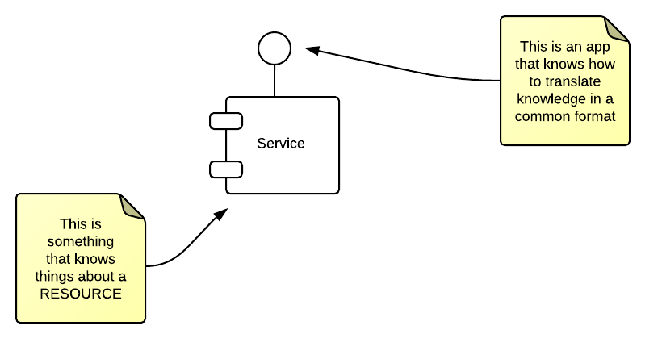
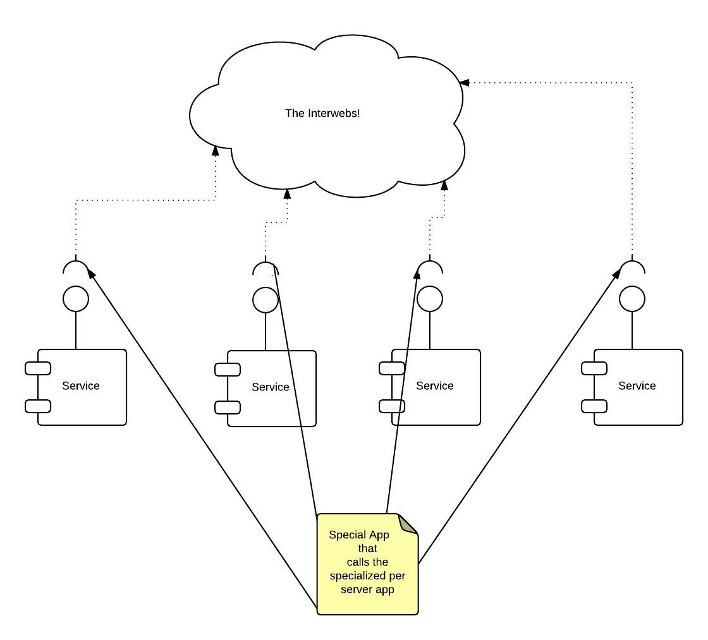
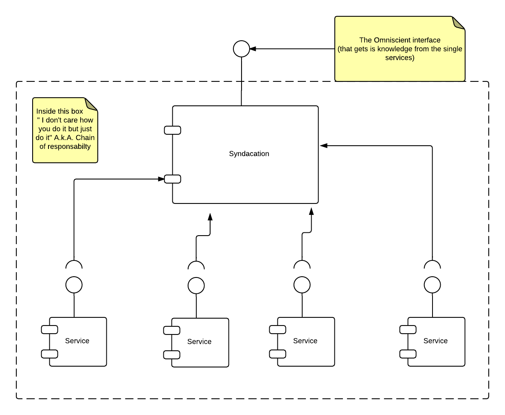

#The complexity of realty

This post will be dedicated to a strange app that came to my mind: the specs are easy
but the solution was not obvious to me so i decided that was worth a post; I hope that
my errors will save someone's else time.

The problem is known as *federation* and the solution is known as *[federated architecture](htps://en.wikipedia.org/wiki/Federated_architecture)*.
This is an high level pattern, but can also apply to small things. In small things is usually called bus.
 In my case i will have a federation of boxes that may have or not knoledge about something (we will call this thing resource). 
We will just say that theese _knoledge fragments_ are accesible via a command line interface, and that an application
exsists that can translate the fragments from the native format to the syndacation format. A small
scheme follows, to keep things clear; the drawing will get layers as the architecture grows. This one does
not look much like the wikipedia's one.

But we already said that there are multiple sources of information, so we will have many services. We will have to 
interconnect all of hteese services, so wee will put on each one there an interface that will be the _trait d'union_
with the system at large.Note that the interfaces, do the same thing: _they call the local magic app_ and serve the result back to the syndacation 

We also want a static entity (and by static i mean that is a fixed point ) that we can query
for _the whole lot of information that we can get on the resource (at any given time)_. 
But let's update our drawing

That's a lot more like the drawing i saw on wikipedia. We know that patterns are good ideas that we
know work quite well in solving a problem, although a couple of things are missing in their universality.
I'D ALSO THROW IN ANOTHER REQUIREMENT:<ZZ<
WE WANT THE SERVICES TO SCALE, BUT WE DONT WANT TO HAVE THE SYSTEM FAIL IF ONE OF THEM FAILS AND GOES DOWN. 
IN OTHER WORDS THE SERVICES SHOULD BE ABLE TO GOT UP AND DOWN AT ANY TIME, AND WE SHOULD CALL ALL THE SERVICES ACTIVE

THIS OTHER REQUIREMENT CREATES A PROBLEM WITH THIS FOLLOWING PHRASE

_**THE WHOLE LOT OF INFORMATION WE CAN GET ON THE RESOURCE AT ANY GIVEN TIME**_

HOW DO WE KNOW THAT WE GOT THE WHOLE INFORMATION? WE NEED A WAY TO KEEP TRACK OF THE SERVICES, A _REGISTER_. WE NEED THIS 
OTHER COMPONENT THEN! WE ALSO NEED THAT THE SERVICES ANNOUNCE THEMSELF AT STARTUP, AND THAT THEY DEANNUNCE THEMSELF AT SHUTDOWN.

